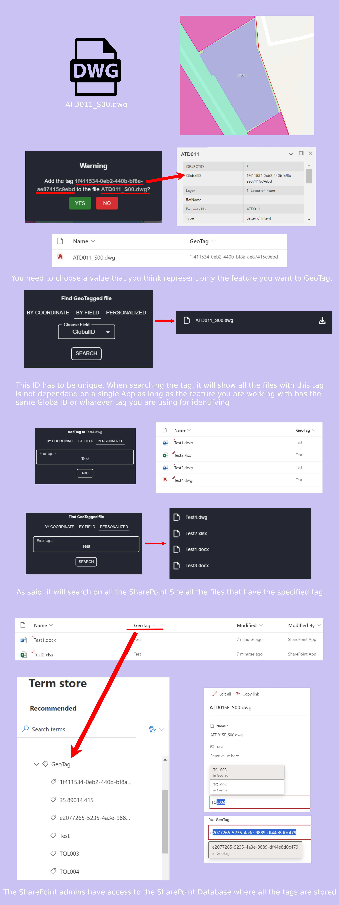

# GeoTag

Widget for Experience Builder, capable of browsing files and folders stored on your company’s SharePoint Sites, pinpoint them on a map and later retrieve them using a user-friendly interface integrated within Experience Builder,

# Documentation

[Installation Guide](Documentation/GeoTagInstallation-Manual.docx)

[Usage](Documentation/GeoTagUsage-Manual.docx)

Developed by GeoSYS

